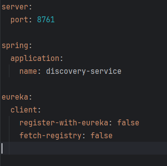
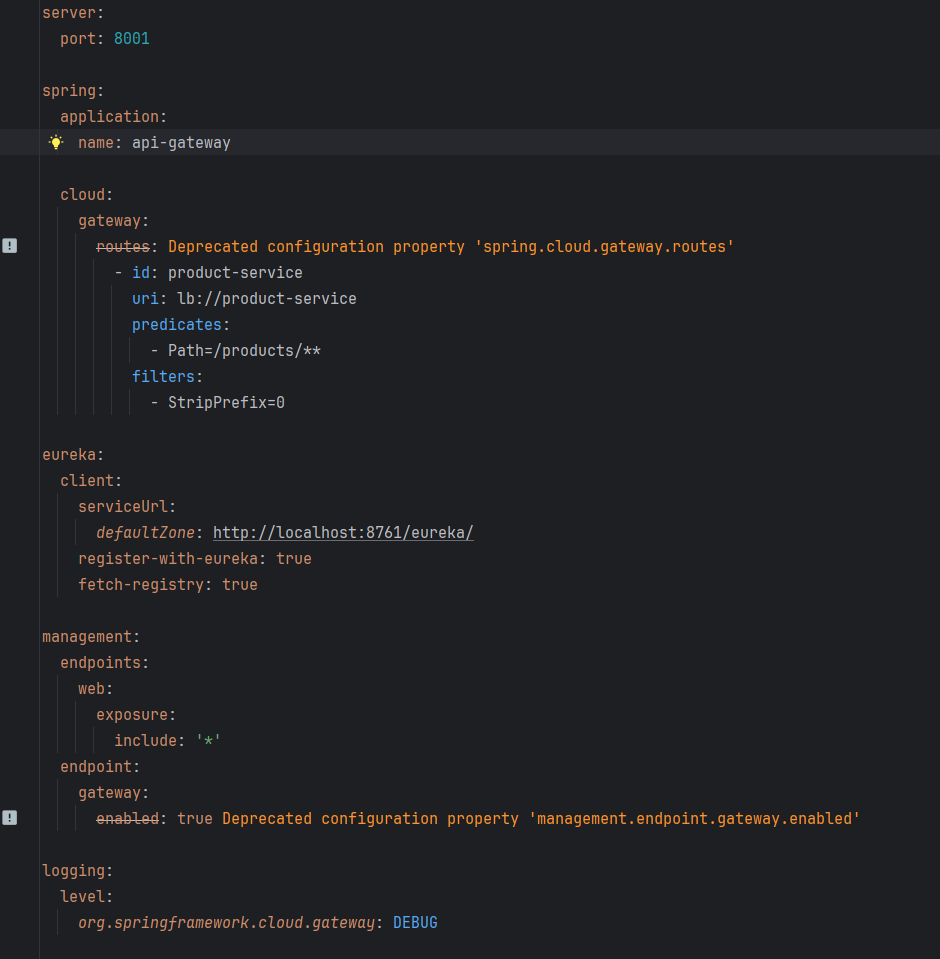
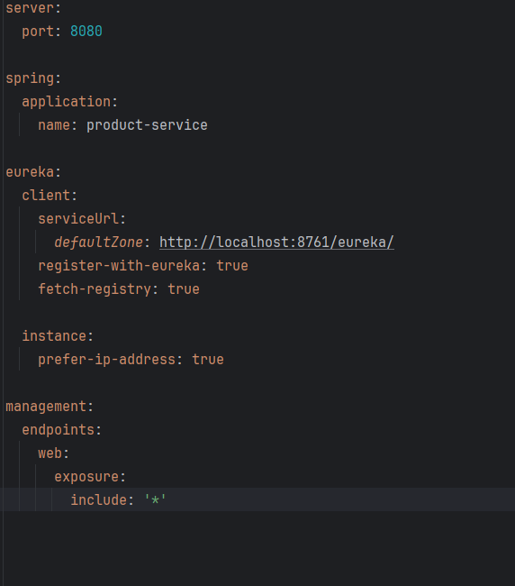

http://localhost:8761/eureka/apps/PRODUCT-SERVICE

#### checking route on api gateway : http://localhost:8001/actuator/gateway/routes

#### checking all application running on eureka : http://localhost:8761/eureka/apps

###### checking health of service 

    management:
    endpoints:
    web:
    exposure:
    include: '*'

#### eureka.yml
 
#### gateway.yml

#### product.yml
 

##### eureka : [docker.io/meassi/eureka-service]
docker build -t eureka-service .
docker images
docker tag eureke-service meassi/eureka-service:latest
docker push meassi/eureka-service:latest

##### gateway : [docker.io/meassi/gateway]

docker build -t gateway .
docker images
docker tag gateway meassi/gateway:latest
docker push meassi/gateway:latest

##### gateway : [docker.io/meassi/gateway]

docker build -t gateway .
docker images
docker tag gateway meassi/gateway:latest
docker push meassi/gateway:latest

##### product : [docker.io/meassi/product-service]

docker build -t product-service .
docker images
docker tag product-service meassi/product-service:latest
docker push meassi/product-service:latest